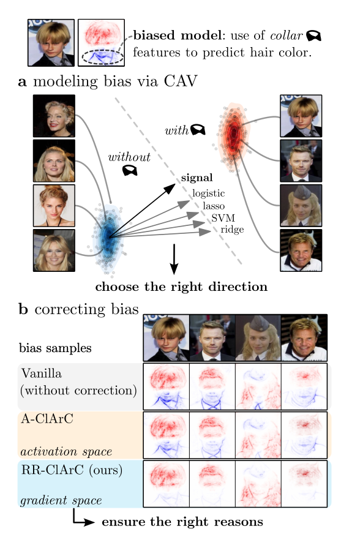

# From Hope to Safety: Unlearning Biases of Deep Models via Gradient Penalization in Latent Space 
# Ghi chú chi tiết bài báo: Right Reason ClArC – Sửa thiên vị mô hình DNN thông qua Concept Activation Vectors

## 1. Giới thiệu

> **Hình 1:** Mô hình học bias từ cổ áo khi dự đoán màu tóc. Phương pháp RR-ClArC sửa bias qua hai bước: (a) xác định hướng bias trong latent space bằng CAV, và (b) giảm độ nhạy của mô hình theo hướng này thông qua fine-tuning. Trong phần (b), ta thấy RR-ClArC giảm rõ vùng heatmap tập trung vào cổ áo so với Vanilla hoặc A-ClArC.

### 1.1 Vấn đề nghiên cứu

Các mô hình mạng nơ-ron sâu (DNN) đang được sử dụng ngày càng phổ biến trong các lĩnh vực như y tế và xe tự lái nhờ vào hiệu năng dự đoán mạnh mẽ. Tuy nhiên, hiệu năng này đôi khi đến từ việc mô hình học phải các tương quan sai lệch (spurious correlations), hay còn gọi là "shortcut" trong dữ liệu huấn luyện. Điều này gây rủi ro nghiêm trọng, đặc biệt trong các ứng dụng an toàn.

Ví dụ: mô hình học cách phân loại tóc không phải từ đặc điểm thật (màu sắc, kết cấu) mà từ các yếu tố không liên quan như "cổ áo", do sự thiên lệch trong tập huấn luyện (nhiều người đàn ông tóc đen mặc áo vest xuất hiện thường xuyên hơn).

### 1.2 Động lực

* Phát hiện và loại bỏ shortcut/bias mà mô hình đã học trong latent space.
* Xử lý cả các loại bias **cục bộ** (local - ví dụ vật thể, hình dạng, màu sắc cụ thể trong vùng ảnh) và **không cục bộ** (non-local - như ánh sáng, nhiễu, màu tổng thể).
* Đảm bảo mô hình đưa ra dự đoán vì **lý do đúng đắn** (right reason), không dựa trên các đặc điểm giả tạo.

### 1.3 Đóng góp chính của bài báo

1. **Giới thiệu RR-ClArC (Right Reason ClArC)** – một framework mới giúp giảm độ nhạy mô hình với bias bằng cách **penalize gradient trong latent space theo hướng bias**.
2. **Áp dụng CAV** để mô hình hóa bias – đặc biệt sử dụng **signal-CAV**, vượt trội hơn các phương pháp như SVM, Ridge Regression, Lasso.
3. **Hiệu chỉnh mô hình** bằng cách fine-tune với loss phụ thuộc gradient, có thể sửa riêng theo từng lớp (class-specific).
4. **Đánh giá toàn diện** RR-ClArC trên nhiều kiến trúc (VGG, ResNet, EfficientNet) và tập dữ liệu (ISIC, Bone Age, CelebA, ImageNet), cho thấy hiệu quả vượt trội so với các baseline như Vanilla, A-ClArC, P-ClArC, RRR.
5. **Chi phí tính toán thấp hơn RRR**, khả năng mở rộng tốt, yêu cầu gán nhãn ít hơn.

