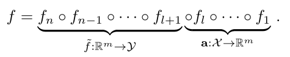
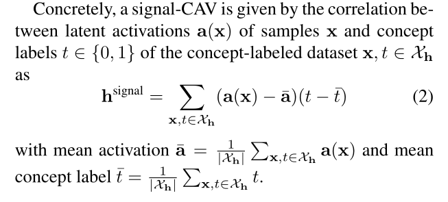
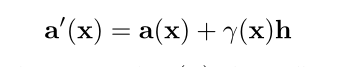
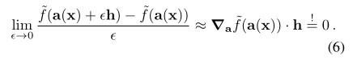
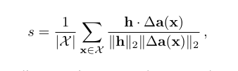
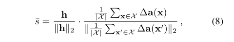
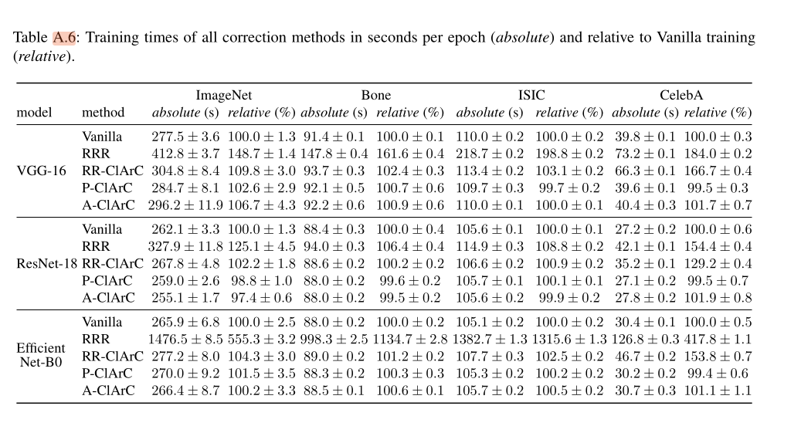
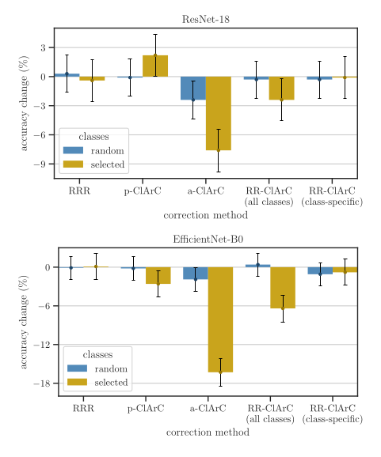

# From Hope to Safety: Unlearning Biases of Deep Models via Gradient Penalization in Latent Space 

## 1. Giới thiệu

> **Hình 1:** Mô hình học bias từ cổ áo khi dự đoán màu tóc. Phương pháp RR-ClArC sửa bias qua hai bước: (a) xác định hướng bias trong latent space bằng CAV, và (b) giảm độ nhạy của mô hình theo hướng này thông qua fine-tuning. Trong phần (b), ta thấy RR-ClArC giảm rõ vùng heatmap tập trung vào cổ áo so với Vanilla hoặc A-ClArC.

### 1.1 Vấn đề nghiên cứu

Các mô hình mạng nơ-ron sâu (DNN) đang được sử dụng ngày càng phổ biến trong các lĩnh vực như y tế và xe tự lái nhờ vào hiệu năng dự đoán mạnh mẽ. Tuy nhiên, hiệu năng này đôi khi đến từ việc mô hình học phải các tương quan sai lệch (spurious correlations), hay còn gọi là "shortcut" trong dữ liệu huấn luyện. Điều này gây rủi ro nghiêm trọng, đặc biệt trong các ứng dụng an toàn.

Ví dụ: mô hình học cách phân loại tóc không phải từ đặc điểm thật (màu sắc, kết cấu) mà từ các yếu tố không liên quan như "cổ áo", do sự thiên lệch trong tập huấn luyện (nhiều người đàn ông tóc đen mặc áo vest xuất hiện thường xuyên hơn).

### 1.2 Động lực

* Phát hiện và loại bỏ shortcut/bias mà mô hình đã học trong latent space.
* Xử lý cả các loại bias **cục bộ** (local - ví dụ vật thể, hình dạng, màu sắc cụ thể trong vùng ảnh) và **không cục bộ** (non-local - như ánh sáng, nhiễu, màu tổng thể).
* Đảm bảo mô hình đưa ra dự đoán vì **lý do đúng đắn** (right reason), không dựa trên các đặc điểm giả tạo.

### 1.3 Đóng góp chính của bài báo

1. **Giới thiệu RR-ClArC (Right Reason ClArC)** – một framework mới giúp giảm độ nhạy mô hình với bias bằng cách **penalize gradient trong latent space theo hướng bias**.
2. **Áp dụng CAV** để mô hình hóa bias – đặc biệt sử dụng **signal-CAV**, vượt trội hơn các phương pháp như SVM, Ridge Regression, Lasso.
3. **Hiệu chỉnh mô hình** bằng cách fine-tune với loss phụ thuộc gradient, có thể sửa riêng theo từng lớp (class-specific).
4. **Đánh giá toàn diện** RR-ClArC trên nhiều kiến trúc (VGG, ResNet, EfficientNet) và tập dữ liệu (ISIC, Bone Age, CelebA, ImageNet), cho thấy hiệu quả vượt trội so với các baseline như Vanilla, A-ClArC, P-ClArC, RRR.
5. **Chi phí tính toán thấp hơn RRR**, khả năng mở rộng tốt, yêu cầu gán nhãn ít hơn.

## 2. Method: Chọn đúng hướng (Choose right direction) và Class Artifact Compensation

> **Hình: Biểu diễn mô hình DNN dạng chuỗi thành phần.**  
### 2.1. Concept Activation Vector (CAV)

* **Định nghĩa:** CAV là vector phân chia giữa các mẫu có concept và không có concept trong latent space của model. Thường được học bằng SVM, Ridge, Lasso, hoặc Logistic Regression.
* **Vấn đề:** Trình tối ưu hóa thường không cho ra hướng concept “thật”, nhất là với dữ liệu nhiễu.
* **CAV mạnh (Signal-CAV):** Dựa trên tương quan giữa activation và nhãn concept (tốt hơn khi nhiều nhiễu).
* 

  * CAV là vector trọng số từ phân biệt hai tập (có và không có artifact) trong latent space.

### 2.2. Class Artifact Compensation (ClArC)

* **Mục tiêu:** Điều chỉnh mô hình khỏi các artifact bằng cách sử dụng CAV.
* **Hai phương pháp chính:**

  * **A-ClArC (Augmentative ClArC):** Thêm artifact vào activation khi fine-tune để dạy model bất biến theo hướng đó.
  * **P-ClArC (Projective ClArC):** Loại artifact khỏi activation khi inference, không cần fine-tune.
  * **RR-ClArC (Right Reason ClArC):** Đề xuất mới: Phạt rõ ràng gradient đầu ra theo hướng CAV khi fine-tune, áp dụng được cả local và non-local bias, hỗ trợ sửa theo từng lớp (class-specific).
* 

## 3. RR-ClArC: Phạt Những Lý Do Sai Lệch

Để giảm độ nhạy của DNN với các thành kiến, chúng tôi giới thiệu RR-ClArC, phương pháp này rõ ràng phạt gradient đầu ra theo hướng của CAV h đại diện cho thành kiến. Cụ thể, RR-ClArC đưa vào một hạng mục mất mát bổ sung cho bước tinh chỉnh, nhằm phạt mô hình khi sử dụng các đặc trưng tương ứng với hướng thành kiến bằng cách tính tích nội giữa CAV h (hướng thành kiến) và gradient của đầu ra theo các đặc trưng tiềm ẩn được biểu diễn bởi

$$ L_{RR}(\mathbf{x}) = (\nabla_{\mathbf{a}} \tilde{f}(\mathbf{a}(\mathbf{x})) \cdot \mathbf{h})^2. $$

Để hỗ trợ việc loại bỏ thành kiến đặc trưng cho từng lớp đối với các mô hình có k (nhiều) đầu ra, chúng tôi mở rộng hạng mục mất mát thành

$$ L_{RR}(\mathbf{x}) = (\nabla_{\mathbf{a}} [\mathbf{m} \cdot \tilde{f}(\mathbf{a}(\mathbf{x}))] \cdot \mathbf{h})^2 $$

Trực giác cho thấy, hạng mục mất mát phạt mô hình khi thay đổi đầu ra khi thêm hoặc loại bỏ các kích hoạt dọc theo hướng bias: 

* 

## 4. Thí nghiệm: TRIỂN KHAI, ĐÁNH GIÁ VÀ PHÂN TÍCH CHI TIẾT

### 4.1. Cài đặt thí nghiệm

#### 4.1.1. Các mô hình và tập dữ liệu

* **Mô hình sử dụng:**

  * VGG-16
  * ResNet-18
  * EfficientNet-B0
* **Tập dữ liệu:**

  * ISIC (ảnh tổn thương da, bias: tăng sáng)
  * Bone Age (X-quang tuổi xương, bias: tăng sáng)
  * CelebA (dự đoán màu tóc, bias: cổ áo/vòng cổ)
  * ImageNet (chèn artifact: timestamp vào ảnh)

#### 4.1.2. Chèn bias (artifact) vào dữ liệu

* Các bias/shortcut được thêm vào ảnh để kiểm tra khả năng mô hình học shortcut hoặc phụ thuộc vào thông tin ngoài lề (ví dụ: timestamp, cổ áo).

#### 4.1.3. Cài đặt mô hình (model training)

* Pretrain mô hình trên tập clean.
* Fine-tune với loss bổ sung (RR-ClArC penalty) để giảm phụ thuộc vào hướng bias (CAV).
* Đối với correction theo class, sử dụng vector chỉ định class (Kronecker-delta).

### 4.2. Concept Activation Vectors (CAV): Xây dựng & phân tích

#### 4.2.1. Xây dựng CAV

* Tập hợp activation từ latent space của model cho các ảnh có và không có artifact.
* Dùng các phương pháp: SVM, Ridge, Signal-based để học CAV phân tách hai nhóm.

  * **Signal-CAV:** Sử dụng sự tương quan trực tiếp giữa feature activation và nhãn artifact, bền vững hơn trước nhiễu.

#### 4.2.2. Kiểm tra CAV alignment with true direction

* **Định lượng:**

  * Tính cosine similarity giữa CAV thu được với hướng bias thật (nếu biết ground-truth).
  * Đánh giá khả năng CAV tìm đúng hướng bias.
* **Định tính (Qualitative alignment):**

  * Vẽ heatmap activation (LRP) với từng loại CAV (SVM, Ridge, Signal) để xem mô hình “chú ý” vào đâu.
  * Kết quả: Signal-CAV thường align tốt hơn, highlight đúng artifact vị trí (ví dụ: timestamp ở góc ảnh ImageNet, cổ áo trong CelebA).
  * 
    * **Mục đích:** Công thức này được sử dụng để đo lường mức độ căn chỉnh (alignment) của một Concept Activation Vector (CAV) h với hướng bias thật trong không gian tiềm ẩn (latent space) của mô hình, dựa trên từng mẫu dữ liệu riêng lẻ trong tập dữ liệu X
    * **Ý nghĩa:** Giá trị s là một chỉ số trung bình cho thấy mức độ CAV h phản ánh đúng hướng bias thật trong không gian tiềm ẩn cho từng mẫu riêng lẻ.Nếu s cao (1), điều này cho thấy CAV h được xây dựng tốt và khớp với hướng bias thật. Ngược lại, nếu sthấp (gần 0 hoặc âm), CAV có thể không chính xác hoặc không đại diện tốt cho bias
    * **Ứng dụng:** Công thức này được sử dụng trong các thí nghiệm có kiểm soát (controlled setting) như ISIC, ImageNet, Bone Age, nơi ta thêm bias vào đầu vào (qua phép biến đổi (phi)) và đo lường xem CAV có bắt được hướng bias đó không.
  * 
    * **So sánh với Individual CAV Alignment Score:** Trong khi invidiual tập trung vào căn chỉnh cho từng mẫu riêng lẻ và sau đó trung bình, overall tính toán căn chỉnh dựa trên vectơ trung bình của sự thay đổi kích hoạt, nên nó phản ánh xu hướng chung hơn. Overall có thể nhạy hơn với các mẫu có sự thay đổi kích hoạt lớn, trong khi individual cân bằng hơn giữa các mẫu.

### 4.3. Revising Model Biases: Hiệu chỉnh mô hình và đánh giá

#### 4.3.1. Tiến hành hiệu chỉnh (Model correction)

* **RR-ClArC penalty:**

  * Thêm loss phạt dựa trên hướng CAV vào quá trình fine-tuning.
  * Hỗ trợ correction class-specific (chỉ một hoặc một số class).

#### 4.3.2. Đo lường và đánh giá kết quả

* **TCAV (Test Concept Activation Vector):**

  * Tính tỷ lệ các mẫu bias mà gradient output hướng theo CAV dương.
  * $$TCAV = \frac{|{x \in X\_{bias}: \nabla \tilde{f}(a(x)) \cdot h > 0}|}{|X\_{bias}|}$$
  * TCAV ≈ 0.5 là tốt nhất (model không bị bias).
* **TCAVsens:**

  * Đo độ nhạy của mô hình với CAV.
  * Giá trị thấp nghĩa là ít phụ thuộc vào bias hơn.
* **Rbias (Relevance bias):**

  * Tính phần đóng góp của bias trên heatmap input (LRP) so với tổng relevance.
  * Tốt nhất càng thấp càng tốt.
* **Kết quả chi tiết:**

  * **RR-ClArC** giảm mạnh TCAVsens và Rbias trên mọi dataset/model.
  * Accuracy trên clean test giữ cao, không giảm mạnh như A/P-ClArC.
  * Correction class-specific cho phép sửa bias từng lớp mà không làm giảm accuracy class khác.

#### 4.3.3. Ablation study

* Thử nghiệm với các giá trị hyperparameter (λ), loại CAV khác nhau (so sánh SVM, Ridge, Signal).
* Tăng λ quá cao làm accuracy giảm trên clean test; signal-CAV vẫn ổn định hơn SVM, Ridge.

### 4.4. Computational Cost & Phân tích thời gian chạy

* **So sánh thời gian chạy (computational cost):**

  * RRR tốn compute nhất (do phải mask input-level, tính gradient nhiều lớp).
  * RR-ClArC cao hơn Vanilla nhưng ít hơn RRR/A-ClArC.
  * 
  * Ví dụ: EfficientNet với RRR tăng thời gian lên \~1300% so với Vanilla; RR-ClArC tăng nhẹ hơn.

### 4.5. Class-specific Model Correction: Sửa lỗi theo lớp

* Thực nghiệm sửa từng class cho thấy RR-ClArC giữ accuracy tốt ở cả các class không bị bias.
* 
* Quan sát: 
    * **RR-ClArC (class-specific)** là phương pháp tốt nhất trên cả hai mô hình (ResNet-18 và EfficientNet-B0), với sự giảm độ chính xác tối thiểu (khoảng 1-2%) trên các lớp được chọn và giữ ổn định trên các lớp ngẫu nhiên.
    * **α-ClArC** có hiệu suất kém nhất, đặc biệt trên EfficientNet-B0, với giảm độ chính xác lên đến 14-15% trên lớp được chọn, cho thấy phương pháp này có thể quá mạnh trong việc loại bỏ bias, ảnh hưởng tiêu cực đến hiệu suất tổng thể.
    * **RRR và p-ClArC** có hiệu suất trung bình, với giảm độ chính xác đáng kể trên lớp được chọn (4-7%), nhưng vẫn tốt hơn α-ClArC.
    * **RR-ClArC (all classes)** nằm giữa, với hiệu suất tốt hơn α-ClArC nhưng không bằng phiên bản class-specific.

### 4.6. Kết quả định tính (Qualitative Result & Alignment)

* RR-ClArC khi hiệu chỉnh đúng hướng giúp heatmap “mất đi” hoặc giảm mạnh vùng attention trên artifact.
* Các phương pháp khác (A/P-ClArC) không align tốt bằng.

### 4.7. Detail model correction result (Phụ lục)

* Bảng A.4, A.5: Chi tiết từng thí nghiệm (accuracy, TCAV, TCAVsens, Rbias) cho từng dataset, từng loại correction.
* Hình A.16: Trade-off accuracy (clean vs bias), RR-ClArC ưu thế rõ ràng nhất.
* Hình A.17: Hiệu chỉnh model từng class cụ thể.

### 4.8. Tóm tắt, phân tích lại toàn diện

* Cài đặt thí nghiệm kỹ, dùng nhiều loại bias và architecture → tăng tính tổng quát.
* Xây dựng CAV bằng nhiều optimizer, signal-CAV mạnh nhất (giải thích rõ bằng heatmap, cosine).
* RR-ClArC là bước tiến lớn về sửa bias, giữ accuracy, tiết kiệm compute hơn RRR.
* Phụ lục cực chi tiết, có thể dùng để làm benchmark tham khảo cho nghiên cứu khác.

---

## 5. Class-specific Model Correction (Sửa lỗi từng lớp)

* Có thể chỉnh bias chỉ cho một class (ví dụ: “tench” trong ImageNet) bằng cách phạt gradient chỉ với class đó.
* RR-ClArC duy trì accuracy các class không liên quan, trong khi A/P-ClArC làm giảm accuracy các class khác do remove khái niệm quá mạnh.

## 6. APPENDIX – Phụ lục

### Model Training & Model Correction

* Training: Các model được pretrain (VGG, ResNet, EfficientNet), fine-tune với loss bổ sung của RR-ClArC, đóng băng một số layer theo hướng dẫn.
* Hyper-parameter: λ (reg strength) quá cao làm accuracy clean test giảm, nên tune cẩn thận.
* Class-specific correction: Chỉ định class correction qua vector m (Kronecker-delta).

### Concept Activation Vectors (CAV) & CAV Optimizer

Để tính toán các CAVs, chúng ta thu thập các kích hoạt của lớp Convolutional cuối cùng của mỗi mô hình. Đối với lớp Convolutional với $m$ bộ lọc, các kích hoạt được định nghĩa là $a^{conv}(x) \in \mathbb{R}^{m \times w \times h}$ với kích thước không gian là $w$ và $h$. Ngoài ra, chúng ta thực hiện phép gộp cực đại (max-pooling) trên chiều không gian của mỗi bản đồ đặc trưng để có được một điểm số duy nhất cho mỗi bộ lọc/nơ-ron $a(x) \in \mathbb{R}^m$, được cho bởi:

$$a_i(x) = \max_{v,q} a_{i,v,q}^{conv}(x). \quad (A.1)$$

Tất cả các CAVs được tính toán trên các mẫu vật giả và các mẫu vật không có thành kiến từ tập dữ liệu đào tạo (ImageNet: "tench"; CelebA: "blonde", "Bone Age: "92-137 months", ISIC: "Melanoma").

#### CAV Optimizer (Bộ Tối ưu hóa CAV)

Trong phần sau, chúng ta sẽ mô tả ngắn gọn hồi quy Ridge, hồi quy Lasso và hồi quy SVM. Các mục tiêu chính của tất cả các phương pháp này, trong cài đặt của chúng ta, là phân chia tuyến tính hai lớp (được mô tả bằng khái niệm nhãn $t_k \in \{0,1\}$) thông qua một siêu phẳng, nơi vectơ $h$ mô tả chuẩn tắc đến siêu phẳng.

Hồi quy Lasso [35] được đưa ra bằng cách tối thiểu hóa phần dư $r_n = (t_n - a_n(x) \cdot h - h_0)$ là:

$$Lasso: \min_{h, h_0} \frac{1}{N} \sum_{n=1}^N r_n^2 + \lambda \sum_{j} |h_j|. \quad (A.2)$$

Đối với tất cả $n$ mẫu $x_n$, với hệ số bias $h_0$ bổ sung. Ở đây, số hạng $\sum_j |h_j|$ dẫn đến các hệ số thưa thớt hơn, giúp cải thiện độ bền chống lại nhiễu trong dữ liệu.
Ngoài ra, hồi quy Ridge [16] được đưa ra bằng cách tối thiểu hóa:

$$Ridge: \min_{h, h_0} \frac{1}{N} \sum_{n=1}^N \sum_{j} (t_n - a_n(x) \cdot h - h_0)^2 + \lambda \sum_{j} h_j^2. \quad (A.3)$$

Với một số hạng chuẩn hóa $L_2$ cho các phần tử của $h$.
Hơn nữa, hồi quy Logistic cung cấp ước tính khả năng tối đa cho xác suất $p_n = \frac{1}{1+e^{-a_n(x) \cdot h - h_0}}$, dẫn đến tối thiểu hóa:

$$Logistic: \min_{h, h_0} \sum_{n=1}^N -[t_n \ln(p_n) + (1-t_n) \ln(1-p_n)]. \quad (A.4)$$

Cuối cùng, SVMs [9] cố gắng tìm một siêu phẳng biểu diễn sự phân tách lớn nhất giữa hai phân bố lớp. Do đó, một hàm mất mát (hinge-loss) được định nghĩa là $l_n = \max(0, 1 - t_n(a_n \cdot h - h_0))$, dẫn đến tối thiểu hóa:

$$SVM: \min_{h, h_0} \frac{1}{N} \sum_{n=1}^N l_n + \lambda \sum_{j} h_j^2. \quad (A.5)$$

Với chuẩn hóa $L_2$ bổ sung, và nhãn $t_n^*$ = $2t_n - 1$.

### Detail Model Correction Result

Phần này trình bày chi tiết các kết quả từ thử nghiệm sửa lỗi mô hình. Chúng tôi mở rộng các phân tích trước đó bằng cách bao gồm các phương pháp sửa lỗi mô hình như RRR, CIArC (A-CIArC, P-CIArC, RR-CIArC), và Vanilla. Để đánh giá hiệu suất, chúng tôi sử dụng thêm hai chỉ số chính:

1.  **Độ nhạy TCAV ($TCAV_{sens}$):** Đo lường mức độ mà mô hình bị ảnh hưởng bởi một khái niệm thiên lệch cụ thể.
2.  **Độ liên quan của thiên lệch ($R_{bias}$):** Định lượng mức độ các vùng thiên lệch trong đầu vào đóng góp vào dự đoán của mô hình.

#### Công thức Tính Độ nhạy TCAV

Độ nhạy TCAV được tính như sau:

$$TCAV_{sens} = \frac{1}{|X_{bias}|} \sum_{x \in X_{bias}} |\nabla_a \bar{f}(a(x)) \cdot h| \quad (A.6)$$

Trong đó:
* $|X_{bias}|$ là số lượng mẫu trong tập dữ liệu bị thiên lệch.
* $\nabla_a \bar{f}(a(x))$ là gradient của điểm số dự đoán của mô hình ($\bar{f}$) đối với các kích hoạt $a(x)$ của đầu vào $x$.
* $h$ là vector CAV đại diện cho khái niệm thiên lệch.
* Chỉ số này đo lường mức độ "phản ứng" của mô hình đối với khái niệm thiên lệch, có tính đến độ lớn của sự liên quan, khác với một số chỉ số TCAV khác chỉ xét dấu.

#### Công thức Tính Độ liên quan của Thiên lệch ($R_{bias}$)

Độ liên quan đầu vào của thiên lệch ($R_{bias}$) được tính toán bằng cách sử dụng phương pháp Layer-wise Relevance Propagation (LRP) để tạo ra bản đồ nhiệt (heatmaps) về sự liên quan của từng pixel. $R_{bias}$ được định nghĩa là tỷ lệ phần trăm liên quan của các pixel trong vùng thiên lệch so với tổng liên quan của toàn bộ hình ảnh. Việc bản địa hóa thiên lệch được thực hiện bằng cách sử dụng một mặt nạ $M$ (với các phần tử $M_i \in \{0,1\}$ cho mỗi pixel $i$):

$$R_{bias} = \frac{\sum_{j} |R_j M_j|}{\sum_{j} |R_j|} \in [0,1]. \quad (A.7)$$

Trong đó:
* $R_j$ là giá trị liên quan (từ LRP) của pixel thứ $j$.
* $M_j$ là giá trị của mặt nạ tại pixel thứ $j$ (1 nếu thuộc vùng thiên lệch, 0 nếu không).
* Chỉ số này nằm trong khoảng từ 0 đến 1, cho biết mức độ đóng góp của thiên lệch vào dự đoán của mô hình.

#### Kết quả và Phân tích

Dựa trên các thí nghiệm đã báo cáo:
* Trong hầu hết các thử nghiệm RR-CIArC, $TCAV_{sens}$ đạt giá trị thấp nhất (ngoại trừ ImageNet và VGG-16, nơi RRR cho kết quả tương tự).
* Đối với $R_{bias}$, phương pháp RRR thường mang lại điểm số thấp nhất. Điều này được kỳ vọng do RRR áp dụng một hình phạt (regularization) mạnh mẽ hơn thông qua các gradient đầu vào.
* Tuy nhiên, RR-CIArC cho thấy một độ dốc $R_{bias}$ thấp hơn so với A-CIArC và P-CIArC.

Các kết quả chi tiết hơn (bao gồm tất cả các phương pháp và siêu tham số) được trình bày dưới dạng biểu đồ phân tán trong Hình A.16. Mục tiêu là đạt được độ chính xác cao trên cả tập dữ liệu bị thiên lệch (bias set) và tập dữ liệu sạch (clean set), được thể hiện bằng các điểm ở góc trên bên phải của biểu đồ. Qua đó, RR-CIArC thường thể hiện sự đánh đổi tối ưu giữa việc giảm độ nhạy thiên lệch (duy trì độ chính xác cao trên tập dữ liệu thiên lệch) và duy trì độ chính xác tổng thể (trên tập dữ liệu sạch).

### Class-specific Model Correction

* Cơ chế phạt riêng biệt giúp RR-ClArC sửa cho đúng class mà không ảnh hưởng xấu đến các class khác.

## 7. Kết luận và hướng phát triển

* RR-ClArC là bước tiến lớn cho correction mô hình hậu hoc, nhất là với các bias phức tạp, non-local.
* Giữ được accuracy, giảm rõ rệt bias, chỉ cần ít label artifact cho CAV, áp dụng cho nhiều model/DL task khác nhau.
* Hướng phát triển: Nghiên cứu thêm về cách chọn CAV tốt, correction cho các loại bias mới, ứng dụng thực tiễn.
